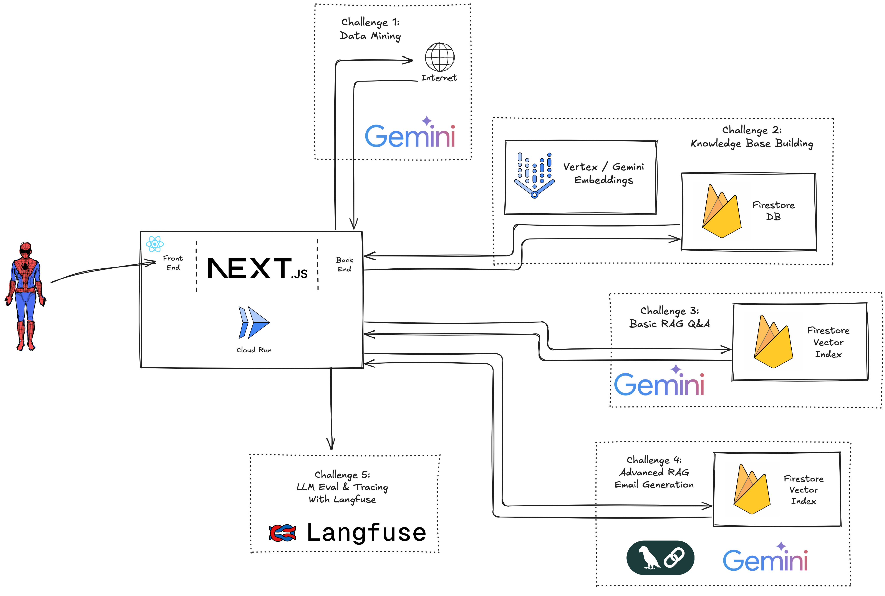

# Welcome to "Building Aaron the Intern": Generative AI Challenge Lab! 👩‍💻👨‍💻

Imagine you're the newest Customer Engineer at Google Cloud. Your task is helping your GCP customers make their tech work on GCP. You surely would love an intern to do the tedious technical research work for you...

But have you ever tried getting budget for something like that..?! Well, great that you live in the age of AI. So why not just building that intern yourself? Let's call "it": **"Aaron the intern"**.

This lab is designed to guide you through  GCP Generative AI, Langchain, and building real-world applications.  We'll be tackling a series of challenges, each building upon the last, to transform a basic Next.js application into a powerful AI-driven tool.

## Getting Started with GCP 🚀

Before you embark on your Gen AI adventure, you'll need to set up your Google Cloud Platform (GCP) environment. Don't worry, it's easier than launching a rocket! Just follow these steps:

**1. Create or Select a GCP Project:**

*   Go to the [GCP Console](https://console.cloud.google.com/), login with your credentials and select the project you have in your sandbox environment. 

**2. Your IDE and Shell in the Cloud:**
*   Open your [Cloud Shell](https://cloud.google.com/shell/docs/launching-cloud-shell)
*   Open youd [Cloud Shell Editor](https://cloud.google.com/shell/docs/launching-cloud-shell-editor)
*   This is your easiest IDE and Shell environment to work through this lab.
*   If you want to work on your local instead, feel free to.

**4. Set up GCP Project and Application Default Credentials (ADC):**

*   In the Shell set your working GCP project with `gcloud config set project <YOUR_PROJECT_ID>`.
*   The easiest way to authenticate is using Application Default Credentials (ADC). Run this command in your terminal:
```bash
gcloud auth application-default login
```


## Get the workshop Content 🚀
**1. Fork the GitHub Repository:**
*   On GitHub create a [fork of this repository](https://github.com/jakobap/aaron/fork). 
*   Make sure to **include all branches**


**2. Clone the fork into your editing environment:**
*   Back in the Cloud Shell run `git clone <url of your forked repo>`. 


## Set Environment Variables:
**1. Env Vars in .env.local:**
-   Create a new file (in your project root) called `.env.local` based on `.env.template`
-   You will find you Gemini Api Key in [AI Studio](https://aistudio.google.com/apikey). You might need to select "Show projects in my organization"
-   Fill out the project ID from your [Cloud Console](https://console.cloud.google.com/welcome)

**1. Env Vars in terraform.tfvars:**
-   Fill out the project ID just as you did in `.env.local`


## Deploy the required Infrastructure:

**1. Run Terraform Script:**
-   Deploy the required GCP Infrastructure with:

```
cd terraform
```

```
terraform init
```

```
terraform plan
```

```
terraform apply
```

## Running the App
After completing the steps above you should be able to run the app and access it on localhost with 
```
npm run dev
```

*Optionally, you can deploy the web app to cloud run by running `make all` in root.*


**Congratulations!** You've completed the basic GCP setup. You are now ready to explore the application and start the challenges!


# Workshop Mechaniccs

We've organized the challenges  using ** GitHub Branches** to keep things clear and manageable as you progress through the challenges.

*   **`main` Branch (Your Starting Point):** This is where you are right now! It contains the base application (and full solution!) –  You can explore the initial setup, run the app, and get familiar with the codebase.  This branch will remain untouched as you work through the challenges. You can always come back or compare to main for the challenge solution.

*   **`001-llm-data-mining`, `002-build-knowledgebase`, `003-simple-rag-qa`, `004-advanced-rag`, `005-llm-eval-and-tracing` Branches (The Challenge Zones):**  Each of these branches represents a specific challenge in your Gen AI journey.  You'll switch to these branches to work on each challenge individually.  Think of them as separate labs, each focused on a specific skill.  Each challenge branch starts from the `main` branch, so you're always building upon a solid foundation.

**To start a challenge, you'll simply switch to its corresponding branch using Git:**

```
bash
git fetch origin
git checkout 001-llm-data-mining # For Challenge 1
git checkout 002-build-knowledgebase # For Challenge 2, and so on...
```

**Don't worry about messing things up!** Because each challenge is in its own branch, you can experiment freely. If you ever want to start fresh, you can always return to the `main` branch or reset your challenge branch back to origin (as long as you don't push your changes).


# Application Architecture 🏗️

Before you dive into the challenges, let's take a bird's-eye view of the application's architecture. This will help you understand how the different components interact.

The application follows a typical web application structure with a Next.js frontend and backend, leveraging Google Cloud services for Generative AI and data storage.

*   **Frontend (Next.js Frontend):**  This is the user interface you interact with in your browser. 

*   **Backend API (Next.js API Routes):**  These are the server-side functions that power the application, handling requests from the frontend and orchestrating the AI processes. Key API routes include:

*   **Langchain Processing Chains:**  Langchain is the framework that structures the AI workflow.

*   **Gemini API:** This service acts as an interface to Google's Gemini family of Generative AI models. It's used for:

*   **Firestore Knowledge Base (Firestore):**  This is the database where the GCP documentation is stored in chunks, along with their vector embeddings. 

*   **Vector Search Util:**  This utility handles the vector search queries against the Firestore knowledge base to retrieve relevant document chunks.

*   **Langfuse (Optional Langfuse):**  Integrated for Challenge 5, Langfuse is an OSS observability platform for LLM applications.


# Your  Missions 🏋️‍♀️

Here's a sneak peek at the challenges that await you:



**Challenge 1: LLM Powered Data Mining - "Web Detective" 🕵️‍♀️**

*   **Mission:**  Bring your text prompting to the next level.
*   **Learnings:**
    *   **Prompt Engineering for Extraction:** Crafting effective prompts to instruct the LLM to extract exactly what you need.  Take a look at the `extractionPrompt` in `src/app/api/content-extraction/route.ts` (lines 9-32) as a starting point.
*   **Key Technologies:** Next.js, Gemini API, Prompt Engineering.

**Challenge 2: Create Knowledge Base - "The Library Builder" 📚**

*   **Mission:**  Implement a custom indexing pipeline on GCP.
*   **Learnings:**
    *   **Chunking Strategies:**  Exploring different ways to divide text into chunks for optimal retrieval.
    *   **Embedding Creation:** Understanding how text embeddings are generated and their role in semantic search.
    *   **Embedding Storage:**  Learning about vector databases (in this case, Firestore is used for simplicity) for efficient storage and retrieval of embeddings.
*   **Key Technologies:** Next.js, Firestore, Gemini API for embeddings, Chunking algorithms.

**Challenge 3: Simple RAG - "The Question Answering Machine" 🤖**

*   **Mission:**  Build a Basic RAG Q&A pipeline.

*   **Learnings:**
    *   **Simple RAG Pipeline:**  Understanding the core components of RAG: Retrieval (searching the knowledge base) and Generation (using an LLM to create answers).
    *   **Semantic Search:**  Using vector search to find relevant documents based on meaning, not just keywords.  The `VectorSearchUtil` is your search engine.
    *   **Prompt Engineering for Summarization:**  Crafting prompts to guide the LLM to generate concise and accurate summaries from retrieved documents. 
*   **Key Technologies:** Next.js, Firestore, Gemini API, Langchain, Vector Search, Prompt Engineering.

**Challenge 4: Advanced RAG - "The Email Alchemist" 📧**

*   **Mission:**  Build an email generation pipeline based on an advanced RAG chain.
*   **Learnings:**
    *   **Prompt Chaining with Langchain:**  Using Langchain's `RunnableSequence` to create complex, multi-step workflows.
    *   **Advanced RAG Techniques:**  Building a more sophisticated RAG system that involves task extraction, research, and email generation.
    *   **Prompt Engineering for Email Generation:**  Designing prompts to create emails that are not only informative but also professional and customer-friendly. 
*   **Key Technologies:** Next.js, Firestore, Gemini API, Langchain, Vector Search, Prompt Chaining, Advanced Prompt Engineering.

**Challenge 5: Tracing & Tracking - "The Observability Guru" 🔭**

*   **Mission:**  Observce and monitor your LLM calls.
*   **Learnings:**
    *   **Tracing and Tracking:**  Understanding the importance of observability in LLM applications.
    *   **Langfuse Integration:**  Using Langfuse to trace requests, monitor performance, and analyze results.
    *   **Quality Control & Experimentation:**  Using tracing data to identify areas for improvement and to evaluate the impact of changes (like prompt modifications).
*   **Key Technologies:** Next.js, Langfuse, Langchain, Observability principles.

## Get Ready to Explore! 🚀

Each challenge will have its own detailed `README.md` file within its branch, providing specific instructions and hints.

So, are you ready to build yoru own "Aaron the intern" and master the power of Generative AI on GCP? Let's get started!  Head over to `challenge-1` branch to begin your adventure! Good luck, and have fun! 🎉